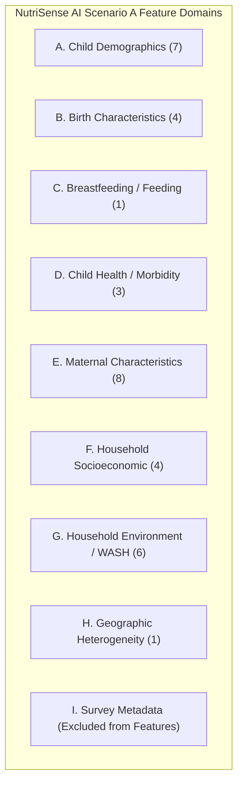
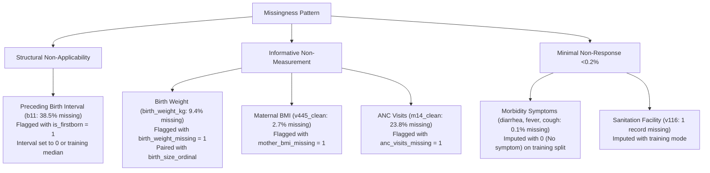

# Step 7 — Feature Engineering

## 1. Objective
The objective of Step 7 is to design and implement a principled, reproducible, leakage-free feature engineering architecture for **NutriSense AI** under the operational constraints of **Scenario A — Community Pre-Screening**.

We establish a comprehensive candidate predictor inventory categorized across 9 logical domains, specify deterministic non-leaking transformations, document explicit justifications for all included and excluded variables, design a principled missingness and encoding strategy that prevents data snooping (ensuring all learned parameters will be fitted strictly on training data in Step 8+), evaluate non-linear age dynamics, and provide automated test assertions verifying zero anthropometric or target leakage.

---

## 2. Scenario A Definition (Community Pre-Screening)

### Operational Setting & Intended Use Case
NutriSense AI is designed as a risk-intelligence and early-triage tool for frontline community health workers (e.g., ASHA and Anganwadi workers operating under POSHAN Abhiyaan in India). 

In community door-to-door screenings and rural outreach camps:
- Accurate digital weighing scales (SECA) and infantometers / stadiometers are often unavailable, uncalibrated, damaged, or logistically impractical to transport.
- Even when scales are present, measurement error, child agitation, and maternal refusal lead to substantial missingness or inaccurate anthropometric measurements.
- Frontline workers have immediate access to maternal recall, immunization cards (Mamta cards / MCP cards), birth history, socioeconomic indicators, environmental WASH conditions, and recent morbidity symptoms.

### Mathematical Prediction Task
Predict the presence of three distinct undernutrition clinical conditions in under-five children ($N = 221{,}263$):
1. **Stunting** ($\text{HAZ} < -2.00\text{ SD}$)
2. **Underweight** ($\text{WAZ} < -2.00\text{ SD}$)
3. **Wasting** ($\text{WHZ} < -2.00\text{ SD}$)

### Absolute Target Leakage Prohibition Rule
To ensure valid pre-screening utility and prevent trivial target leakage:
- **Prohibited Anthropometric Variables**: `hw70`, `hw71`, `hw72`, `hw73` (continuous WHO z-scores); `hw2` (measured weight in kg); `hw3` (measured height/length in cm); and `hw4`–`hw12` (percentiles, standard deviations, and percent of reference medians).
- **Prohibited Derived Features**: Any mathematical combination or transformation of child weight, height, or z-scores.
- **Prohibited Target Labels**: `stunting`, `underweight`, `wasting`, and their severe variants (`*_severe`).
- **Prohibited Eligibility Flags**: `eligible_stunting`, `eligible_underweight`, `eligible_wasting`, `eligible_complete_unified`.

---

## 3. Feature Eligibility Criteria

A variable is eligible for inclusion in the Scenario A candidate predictor set if and only if it satisfies all four criteria:
1. **Non-Invasive Community Feasibility**: The information can be collected through verbal maternal interview, physical observation of the dwelling, or inspection of child health cards, without requiring laboratory equipment, capillary blood draws, or clinical weighing scales.
2. **Pre-Outcome Temporal Validity**: The feature represents biological, demographic, maternal, socioeconomic, or recent symptomatic risk factors preceding or co-occurring with malnutrition onset, rather than a diagnostic measurement of the condition itself.
3. **Generalizability & Non-Arbitrariness**: The variable represents an intrinsic characteristic of the child, caregiver, or household, rather than survey administrative artifacts (e.g., cluster IDs, interviewer codes).
4. **Acceptable Non-Response Rate**: The variable has sufficient coverage across the living under-five cohort (variables with $>80\%$ missingness due to questionnaire sub-routing are excluded).

---

## 4. Candidate Feature Inventory Across 9 Logical Domains

Candidate variables in the cleaned NFHS-5 dataset were audited and categorized into 9 logical domains:



---

## 5. Included Features (The 34-Feature Candidate Matrix)

The feature engineering pipeline (`src/features/build_features.py`) constructs **34 non-leaking candidate features**:

| # | Feature Name | Source Column | Domain | Feature Type | Valid $N$ | Missing (%) | Description & Handling |
| :---: | :--- | :---: | :--- | :---: | :---: | :---: | :--- |
| **1** | `child_age_months` | `hw1` | Child Demographics | Numerical | 221,263 | 0.00% | Exact completed age in months (0–59 mo). Candidate continuous representation. |
| **2** | `child_age_group` | `hw1` | Child Demographics | Ordinal / Categorical | 221,263 | 0.00% | Clinical developmental stages (`00_05_mo`, `06_11_mo`, `12_23_mo`, `24_35_mo`, `36_47_mo`, `48_59_mo`). Candidate binned representation; joint utility/redundancy with continuous age will be evaluated after train/test splitting. |
| **3** | `child_sex_male` | `b4` | Child Demographics | Binary | 221,263 | 0.00% | 1 = Male (52.0%), 0 = Female (48.0%). |
| **4** | `birth_order` | `bord` | Child Demographics | Numerical | 221,263 | 0.00% | Birth order sequence number (1 to 16). |
| **5** | `is_multiple_birth` | `b0` | Child Demographics | Binary | 221,263 | 0.00% | 1 = Twin / Multiple birth (1.6%), 0 = Single birth (98.4%). |
| **6** | `preceding_birth_interval_months` | `b11` | Child Demographics | Numerical | 136,133 | 38.47% | Completed months since preceding birth (paired with `is_firstborn`). |
| **7** | `is_firstborn` | `b11`, `bord` | Child Demographics | Binary | 221,263 | 0.00% | Structural flag: 1 = Firstborn child (no preceding interval), 0 = Has older sibling. |
| **8** | `birth_size_ordinal` | `m18_clean` | Birth Characteristics | Ordinal | 218,383 | 1.30% | Subjective size at birth (1=Very large to 5=Very small). Ordinal encoding represents category order but does not imply equal numerical distances. |
| **9** | `birth_weight_kg` | `birth_weight_kg` | Birth Characteristics | Numerical | 200,376 | 9.44% | Recorded or recalled birth weight in kg (0.5 to 6.0 kg). May be available from health card or caregiver report but is not universally available at community screening. |
| **10** | `birth_weight_missing` | `birth_weight_kg` | Birth Characteristics | Binary | 221,263 | 0.00% | Binary indicator that a valid birth weight value is unavailable after Step 4 cleaning (1=Unavailable, 0=Available). |
| **11** | `delivery_place_type` | `m15` | Birth Characteristics | Nominal | 221,263 | 0.00% | Delivery location: `Public_Facility`, `Private_Facility`, `Home_Delivery`, `Other`. |
| **12** | `still_breastfeeding` | `still_breastfeeding` | Breastfeeding / Feeding | Binary | 211,369 | 4.47% | 1 = Actively nursing (48.1%), 0 = Weaned (47.4%). |
| **13** | `diarrhea_recent` | `diarrhea_recent` | Child Health | Binary | 221,023 | 0.11% | Recent acute diarrhea episode in preceding 2 weeks (1=Yes, 0=No). |
| **14** | `fever_recent` | `fever_recent` | Child Health | Binary | 221,119 | 0.07% | Recent acute fever episode in preceding 2 weeks (1=Yes, 0=No). |
| **15** | `cough_recent` | `cough_recent` | Child Health | Binary | 221,006 | 0.12% | Recent acute cough / ARI episode in preceding 2 weeks (1=Yes, 0=No). |
| **16** | `mother_age_years` | `v012` | Maternal Characteristics | Numerical | 221,263 | 0.00% | Mother's current completed age in years (15–49 years). |
| **17** | `mother_age_first_birth` | `v212` | Maternal Characteristics | Numerical | 221,263 | 0.00% | Mother's age at first childbirth in years. |
| **18** | `mother_education_level` | `v106` | Maternal Characteristics | Ordinal | 221,263 | 0.00% | 0 = No education, 1 = Primary, 2 = Secondary, 3 = Higher. Ordinal encoding represents category order but does not imply equal numerical distances. |
| **19** | `mother_bmi` | `v445_clean` | Maternal Characteristics | Numerical | 215,410 | 2.65% | Mother's Body Mass Index ($\text{kg/m}^2$, range 12.02 to 59.99). |
| **20** | `mother_bmi_missing` | `v445_clean` | Maternal Characteristics | Binary | 221,263 | 0.00% | Binary indicator that a valid maternal BMI value is unavailable after Step 4 cleaning (1=Unavailable, 0=Available). |
| **21** | `total_children_born` | `v201` | Maternal Characteristics | Numerical | 221,263 | 0.00% | Parity count: Total children ever born to mother. |
| **22** | `anc_visits_count` | `m14_clean` | Maternal Characteristics | Numerical | 168,553 | 23.82% | Antenatal care visit count during pregnancy (0 to 95 visits). |
| **23** | `anc_visits_missing` | `m14_clean` | Maternal Characteristics | Binary | 221,263 | 0.00% | Binary indicator that a valid ANC visit count is unavailable after Step 4 cleaning (1=Unavailable, 0=Available). |
| **24** | `wealth_quintile` | `v190` | Household Socioeconomic | Ordinal | 221,263 | 0.00% | Household wealth quintile (1=Poorest to 5=Richest). Ordinal encoding represents category order but does not imply equal numerical distances. |
| **25** | `is_rural` | `v025` | Household Socioeconomic | Binary | 221,263 | 0.00% | 1 = Rural residence (76.8%), 0 = Urban residence (23.2%). |
| **26** | `caste_category` | `caste_clean` | Household Socioeconomic | Nominal | 221,263 | 0.00% | India social group: `Scheduled_Caste`, `Scheduled_Tribe`, `OBC`, `General_None`, `Missing_Caste`. |
| **27** | `religion_category` | `v130` | Household Socioeconomic | Nominal | 221,263 | 0.00% | Religion: `Hindu`, `Muslim`, `Christian`, `Sikh`, `Other`. |
| **28** | `drinking_water_type` | `v113` | Household Environment | Nominal | 221,263 | 0.00% | WHO/UNICEF JMP categories: `Improved_Piped`, `Improved_Groundwater_Bottled`, `Unimproved_Surface_Other`. |
| **29** | `sanitation_facility_type` | `v116` | Household Environment | Nominal | 221,263 | 0.00% | WHO/UNICEF JMP categories: `Flush_Toilet`, `Pit_Latrine`, `Open_Defecation_None`, `Other_Facility`. |
| **30** | `has_electricity` | `v119` | Household Environment | Binary | 221,263 | 0.00% | Household electricity connection (1=Yes, 0=No). |
| **31** | `clean_cooking_fuel` | `v161` | Household Environment | Binary | 221,263 | 0.00% | 1 = Clean fuel (LPG/Gas/Electricity/Biogas: 44.5%), 0 = Solid/Biomass fuel (55.5%). |
| **32** | `household_size` | `v136` | Household Environment | Numerical | 221,263 | 0.00% | Total usual household members listed in roster. |
| **33** | `household_head_female` | `v151` | Household Environment | Binary | 221,263 | 0.00% | 1 = Female-headed household (14.2%), 0 = Male-headed (85.8%). |
| **34** | `state_id` | `v024` | Geographic Characteristics | Nominal | 221,263 | 0.00% | State/UT identifier across 36 Indian administrative units. Retained as a candidate predictive feature because state/UT information can be available during community screening. Its contribution and geographic generalization will be evaluated after the train/validation/test strategy is established. |

---

## 6. Excluded Features and Explicit Rationale

A total of **59 variables** were audited and explicitly excluded from the Scenario A predictive feature matrix:

### A. Direct Anthropometric Target Leakage (22 Variables)
- `hw70`, `hw71`, `hw72`, `hw73`: Raw continuous WHO z-scores; direct mathematical definitions of the prediction targets.
- `hw70_clean`, `hw71_clean`, `hw72_clean`, `hw73_clean`: Cleaned continuous z-scores used for label assignment.
- `hw2`, `hw3`, `hw2_clean`, `hw3_clean`: Physical child weight (kg) and height (cm); prohibited in scale-free Scenario A pre-screening.
- `hw4`, `hw7`, `hw10`: Percentiles of WHO reference standards; direct mathematical derivatives of targets.
- `hw5`, `hw8`, `hw11`: Legacy NCHS standard deviations; direct target leakage.
- `hw6`, `hw9`, `hw12`: Percent of reference median; mathematical derivatives of child weight and height.
- `hw13`: Measurement audit code ("Result of measurement"); post-hoc survey administration audit.

### B. Target Columns & Eligibility Flags (10 Variables)
- `stunting`, `underweight`, `wasting`: Ground-truth binary outcome labels ($y$).
- `stunting_severe`, `underweight_severe`, `wasting_severe`: Ground-truth severe outcome labels.
- `eligible_stunting`, `eligible_underweight`, `eligible_wasting`, `eligible_complete_unified`: Cohort selection flags.

### C. Invasive Clinical Testing Unavailable in Community Settings (2 Variables)
- `hw57` (Child anemia level / Hemoglobin): Requires capillary finger-prick blood test and HemoCue photometer. ASHA workers conducting community screenings do not carry invasive blood-testing equipment; also has 16.91% missingness.
- `v457` (Maternal anemia level): Requires capillary blood collection (3.65% missing).

### D. Extreme Missingness Due to Questionnaire Sub-Sampling (5 Variables)
- `v701`, `v701_clean` (Husband/partner's education): **84.82% missing** in KR file because it is only routed to currently married women interviewed in specific household sub-schedules. Including it would force artificial imputation for ~187,000 children.
- `v714` (Mother working / occupation): **84.74% missing** in KR file for similar sub-routing reasons.
- `m4_completed_months`: **67.87% missing** because 106,538 actively nursing children (code 95) have right-censored durations. Using completed duration would force deletion or false zero-imputation of nursing infants; replaced by `still_breastfeeding`.
- `m4_censored_months`: Survival analysis duration variable where active nursing is right-censored at child's current age. Retained for survival analysis, excluded from primary tabular classifier.

### E. Redundant Raw Variables Replaced by Cleaned Representations (12 Variables)
- `m19` (raw birth weight): Replaced by `birth_weight_kg` and `birth_weight_missing`.
- `m18` (raw birth size): Replaced by `birth_size_ordinal`.
- `m14` (raw ANC visits): Replaced by `anc_visits_count` and `anc_visits_missing`.
- `v445` (raw maternal BMI): Replaced by `mother_bmi` and `mother_bmi_missing`.
- `s116` (raw caste): Replaced by `caste_category`.
- `h11`, `h22`, `h31` (raw morbidity codes): Replaced by clean binary indicators `diarrhea_recent`, `fever_recent`, `cough_recent`.
- `m4`, `v404`: Replaced by validated binary `still_breastfeeding` indicator.
- `b8` (child age in completed years): Coarse duplicate of `hw1` (child age in completed months).
- `b5` (child alive): Constant ($= 1$) across all living under-five cohort records.

### F. High-Cardinality District Identifier (1 Variable)
- `sdist` (District code, 707 administrative districts): Excluded from primary tabular feature matrix to prevent extreme spatial overfitting and geographic memorization. Retained solely for post-hoc subgroup auditing.

### G. Survey Design Identifiers and Sampling Weights (7 Variables)
- `v001` (Cluster number / PSU): Arbitrary administrative survey cluster code.
- `v002` (Household number): Arbitrary survey sequence ID.
- `v003` (Respondent line number): Administrative survey roster index.
- `v005`, `sample_weight`: Statistical sampling weights ($v005 / 10^6$) adjusting for survey selection probabilities; not an intrinsic child risk predictor.
- `v021`, `v022`: Survey strata and PSU codes for complex variance estimation.

**Reconciliation of Excluded Feature Count**:
$$22 \text{ (Anthro)} + 10 \text{ (Targets)} + 2 \text{ (Invasive)} + 5 \text{ (Missingness/Censored)} + 12 \text{ (Raw Redundant)} + 1 \text{ (District)} + 7 \text{ (Survey Design)} = \mathbf{59 \text{ Variables}}.$$

---

## 7. Principled Missing-Value Strategy

### Core Methodological Rules
1. **Zero Global Dropna**: Global complete-case deletion could substantially reduce the analytical sample because several candidate predictors contain structural or questionnaire-related missingness (an empirical audit across the 34 candidate features reveals that **124,264 observations, or 56.16% of the cohort**, have at least one missing value, primarily driven by structural firstborn status in birth interval [38.5%] and unrecorded ANC visits [23.8%]). Applying naive `dropna()` would discard more than half the analytical population and introduce severe selection bias against firstborns and home births.
2. **No Data Snooping**: In accordance with machine learning integrity, **no imputers, scalers, or encoders are fitted on the complete dataset during Step 7**. All learned parameters (e.g., median, mode, encodings) will be fitted strictly on training folds in Step 8+.
3. **Explicit Missingness Indicators**: For variables with non-random missingness, we construct paired binary missingness flags so the model can evaluate both recorded values and availability:
   - `birth_weight_missing`: Binary indicator that a valid birth weight value is unavailable after Step 4 cleaning.
   - `mother_bmi_missing`: Binary indicator that a valid maternal BMI value is unavailable after Step 4 cleaning.
   - `anc_visits_missing`: Binary indicator that a valid ANC visit count is unavailable after Step 4 cleaning.
   - `is_firstborn`: Structural indicator that preceding birth interval is logically non-applicable.

### Handling by Variable Type



---

## 8. Numerical Feature Preprocessing & Scaling Strategy

### Identified Numerical Features (11 Predictors)
- `child_age_months` (0–59 months)
- `birth_order` (1–16)
- `preceding_birth_interval_months` (6–250 months)
- `birth_weight_kg` (0.5–6.0 kg)
- `mother_age_years` (15–49 years)
- `mother_age_first_birth` (10–48 years)
- `mother_bmi` (12.02–59.99 $\text{kg/m}^2$)
- `total_children_born` (1–16)
- `anc_visits_count` (0–95 visits)
- `household_size` (1–37 members)
- `birth_size_ordinal` (treated as numerical or ordinal rank 1–5)

### Scaling Recommendations by Downstream Model Family
- **Tree-Based Models (Random Forest, XGBoost, LightGBM)**:
  - *Recommendation*: **No scaling required**. Tree split points are invariant to monotonic transformations and independent of feature scales.
- **Linear / Regularized Models (Logistic Regression with L1/L2 penalty)**:
  - *Recommendation*: **StandardScaler or RobustScaler** (fitted strictly on training folds). Unscaled features with large ranges (e.g., preceding birth interval up to 250, age up to 59) would dominate gradient updates relative to small-magnitude features (e.g., birth weight 0.5–6.0 kg).
- **Distance-Based Models (KNN, SVM, Neural Networks)**:
  - *Recommendation*: **RobustScaler** to mitigate the influence of extreme physiological outliers (e.g., high parity, extreme household size).

---

## 9. Categorical Feature Preprocessing Strategy

### Identified Categorical & Ordinal Features (23 Predictors)

1. **Binary Features (13 Predictors)**:
   - `child_sex_male`, `is_multiple_birth`, `is_firstborn`, `birth_weight_missing`, `still_breastfeeding`, `diarrhea_recent`, `fever_recent`, `cough_recent`, `mother_bmi_missing`, `anc_visits_missing`, `is_rural`, `has_electricity`, `clean_cooking_fuel`, `household_head_female`.
   - *Encoding*: Pass-through as $\{0, 1\}$ integer indicators.
2. **Ordered / Ordinal Categorical Features (3 Predictors)**:
   - `wealth_quintile` (1=Poorest to 5=Richest)
   - `mother_education_level` (0=No education, 1=Primary, 2=Secondary, 3=Higher)
   - `birth_size_ordinal` (1=Very large to 5=Very small)
   - *Methodological Distinction*: Ordinal encoding represents category order but does **NOT** imply equal numerical distances between categories. For example, moving from "No education" (0) to "Primary" (1) does not mathematically represent the same quantitative increment as moving from "Secondary" (2) to "Higher" (3). Tree-based algorithms handle ordinal categories naturally by evaluating split thresholds, whereas linear baselines will evaluate both ordinal rank and one-hot contrast encodings.
3. **Nominal Categorical Features (7 Predictors including State and Age Group)**:
   - `delivery_place_type` (4 levels: `Public_Facility`, `Private_Facility`, `Home_Delivery`, `Other`)
   - `caste_category` (5 levels: `Scheduled_Caste`, `Scheduled_Tribe`, `OBC`, `General_None`, `Missing_Caste`)
   - `religion_category` (5 levels: `Hindu`, `Muslim`, `Christian`, `Sikh`, `Other`)
   - `drinking_water_type` (3 levels: `Improved_Piped`, `Improved_Groundwater_Bottled`, `Unimproved_Surface_Other`)
   - `sanitation_facility_type` (4 levels: `Flush_Toilet`, `Pit_Latrine`, `Open_Defecation_None`, `Other_Facility`)
   - `child_age_group` (6 levels: `00_05_mo`, `06_11_mo`, `12_23_mo`, `24_35_mo`, `36_47_mo`, `48_59_mo`)
   - `state_id` (36 administrative units)
   - *Encoding Plan*: Nominal categorical variables will initially be represented using one-hot encoding within a leakage-safe preprocessing pipeline. Alternative encodings may be evaluated after train/validation/test splitting and must be fitted exclusively on training data.

---

## 10. Age Dynamics and Representation

As observed in Step 6:
- Acute wasting prevalence is highest in early infancy (26.0% at 0–5 months) and declines monotonically toward 48–59 months (15.9%).
- Chronic stunting prevalence is lower in early infancy (24.5% at 0–5 months) and peaks in toddlerhood (39.7% at 12–23 months).

### Evaluated Representations
1. **Continuous Age (`child_age_months`)**: Retained as primary continuous predictor. Enables tree algorithms (XGBoost, Random Forest) to discover exact non-linear threshold split points.
2. **Clinical Developmental Age Brackets (`child_age_group`)**: Binned into 6 pediatric developmental intervals aligned with WHO and Indian Academy of Pediatrics (IAP) milestones (`00_05_mo`, `06_11_mo`, `12_23_mo`, `24_35_mo`, `36_47_mo`, `48_59_mo`).
3. *Current Step 7 Status*: Both `child_age_months` and `child_age_group` are retained as candidate representations in Step 7. Their joint utility, comparative predictive performance, and potential redundancy will be evaluated empirically after train/validation/test splitting. Neither representation is pre-emptively discarded during Step 7.

---

## 11. Maternal Feature Handling

- **Maternal BMI**: Continuous `mother_bmi` (`v445_clean`, range 12.02 to 59.99 $\text{kg/m}^2$) is selected as the primary feature because it retains full continuous variation. Paired with `mother_bmi_missing` (indicator that a valid value is unavailable after Step 4 cleaning).
- **Maternal Education**: Retained as an ordered rank (`0` to `3`), representing educational hierarchy without assuming equal numerical spacing.
- **Antenatal Care Visits**: Retained as continuous `anc_visits_count` (0 to 95 visits) paired with `anc_visits_missing` (indicator that a valid value is unavailable after Step 4 cleaning).

---

## 12. Birth and Feeding Feature Handling

- **Birth Weight (`birth_weight_kg`)**: Continuous birth weight (0.5 to 6.0 kg). Birth weight may be available from child immunization / MCP cards or caregiver report, but is not universally available at community screening. Keeping `birth_weight_kg`, `birth_weight_missing`, and `birth_size_ordinal` allows the model to evaluate both recorded/recalled birth weight and its availability without discarding unweighed children.
- **Subjective Birth Size (`birth_size_ordinal`)**: (1=Very large to 5=Very small) serves as an indispensable proxy when numerical birth weight is missing, with ordinal ranking representing birth size order without assuming equal metric spacing.
- **Breastfeeding (`still_breastfeeding`)**: Binary indicator (0/1) capturing active vs completed nursing. `m4_completed_months` and `m4_censored_months` are excluded from the primary tabular feature matrix to prevent survival-censoring distortions.

---

## 13. Geographic and Regional Feature Handling

- **State / Union Territory (`v024` / `state_id`)**:
  - `state_id` is retained as a candidate predictive feature because state/UT information can be available during community screening. Its contribution and geographic generalization will be evaluated after the train/validation/test strategy is established.
  - A later ablation analysis during model development (Step 9+) may compare:
    - Model with `state_id` (assessing maximum predictive capacity when subnational administrative unit is known)
    - Model without `state_id` (assessing pure clinical/socio-demographic portability across new geographic borders)
  - Neither model is pre-emptively fitted or selected during Step 7.
- **District (`sdist`)**: Excluded from feature matrix due to extreme cardinality (707 districts) and severe risk of memorizing local sampling noise.
- **GPS / Cluster Coordinates**: Excluded completely in adherence to DHS privacy agreements and research ethics.

---

## 14. Survey-Variable Handling & Leakage Prevention

| Variable Name | Role in DHS | Treatment in NutriSense AI | Methodological Justification |
| :--- | :--- | :---: | :--- |
| `v005` / `sample_weight` | Sampling probability weight | **EXCLUDED** from Features | Sampling weights represent survey design corrections for non-response and stratum oversampling. Feeding weights to a model induces it to learn sampling artifacts rather than child physiological risk. Retained solely for weighted evaluation. |
| `v001` / `v021` | Cluster number / PSU | **EXCLUDED** from Features | Primary sampling unit code; causes arbitrary geographic memorization of specific survey enumeration areas. |
| `v002`, `v003` | Household / Line numbers | **EXCLUDED** from Features | Arbitrary survey administrative sequence numbers. |
| `v022` | Stratum code | **EXCLUDED** from Features | Complex survey variance estimation parameter. |

---

## 15. Base Paper Comparison (Islam et al., 2024, PLOS ONE)

| Dimension | Base Research Paper (Islam et al., 2024) | NutriSense AI (Our Project) | Comparison & Methodological Notes |
| :--- | :--- | :--- | :--- |
| **Dataset Source** | Bangladesh DHS 2017–18 ($N = 7{,}859$) | India NFHS-5 2019–21 ($N = 221{,}263$) | **>25x Larger Scale**; continent-level diversity across India. |
| **Prediction Setting** | Post-hoc analytical ML modeling | **Scenario A — Community Pre-Screening** | Strictly enforces scale-free frontline feasibility (no child height/weight measurements). |
| **Predictor Count** | ~20 candidate predictors | **34 candidate features across 8 active domains** | More comprehensive environmental (WASH, clean cooking fuel, electricity) and birth spacing architecture. |
| **Missingness Strategy** | Dropped missing observations or single imputation | **Principled missingness flags** (`is_firstborn`, `birth_weight_missing`, `mother_bmi_missing`, `anc_visits_missing`) | Preserves 100% of analytical cohort ($N = 221{,}263$) without biased complete-case deletion. |
| **Breastfeeding Handling** | Used duration without explicit right-censoring correction | Separated active nursing (`still_breastfeeding`) from completed duration | Prevents right-censored infant duration distortions. |
| **Country-Specific Factors** | Division, religion, paternal occupation | Added **Caste / Social Category** (`caste_category`: SC/ST/OBC/General), household electricity, clean cooking fuel | Accounts for India-specific social determinants under National Health Mission guidelines. |

---

## 16. Limitations of Feature Engineering

1. **Self-Reported Maternal Recall**: Morbidity episodes (diarrhea, fever, cough), size at birth, and ANC visit counts rely on maternal recall, which is subject to recall decay and subjective perception.
2. **Absence of Dietary Diversity Microdata**: The KR Children's Recode contains detailed 24-hour infant and young child feeding (IYCF) recall primarily for living children aged 6–23 months, creating structural missingness for children aged 24–59 months. Consequently, general household asset and food security proxies (wealth quintile, clean water) are utilized instead of universal micro-nutrient intake variables.
3. **Paternal Characteristics Omission**: Paternal education (`v701`) and maternal employment (`v714`) had $>84\%$ missingness in the KR file due to survey sub-sampling and were excluded to prevent extensive artificial imputation.

---

## 17. Viva / Interview Questions & Answers

### Q1: Why did you exclude child weight (`hw2`) and height (`hw3`) from your feature matrix when they are the strongest predictors of malnutrition?
**Sample Answer**:
"In our project, we are developing a clinical pre-screening decision support tool under **Scenario A — Community Pre-Screening**. The ground-truth targets—stunting, underweight, and wasting—are defined directly by World Health Organization (WHO) formulas that take height, weight, and age as mathematical inputs ($HAZ = f(\text{height}, \text{age})$, $WAZ = f(\text{weight}, \text{age})$, $WHZ = f(\text{weight}, \text{height})$). Including child weight and height in the feature matrix would cause trivial mathematical target leakage, producing artificially inflated model accuracy ($>99\%$) that would completely fail when deployed in rural community screening camps where frontline ASHA workers do not have access to calibrated digital scales or infantometers. By strictly excluding anthropometric measurements, our model evaluates true risk intelligence using demographic, maternal, birth, and environmental indicators."

### Q2: Why did you create missingness indicator flags like `is_firstborn` and `birth_weight_missing` instead of simply dropping rows with missing values (`dropna`)?
**Sample Answer**:
"Global complete-case deletion could substantially reduce the analytical sample because several candidate predictors contain structural or questionnaire-related missingness. An empirical audit across our 34 candidate features reveals that 124,264 observations, or 56.16% of the cohort, have at least one missing value. Crucially, this missingness is not Missing Completely at Random (MCAR). Preceding birth interval (`b11`) is missing for 38.5% of children specifically because they are firstborn children who have no preceding sibling. Dropping these records would systematically exclude all firstborn children from our AI model, creating severe algorithmic selection bias. Similarly, birth weight is unmeasured predominantly for home deliveries in rural households. By pairing continuous features with explicit indicators that a valid value is unavailable after Step 4 cleaning (`is_firstborn`, `birth_weight_missing`), the model preserves 100% of the sample and can learn both recorded values and the informative clinical signal carried by availability itself."

### Q3: Why did you exclude DHS sampling weights (`v005`) from the machine learning feature matrix?
**Sample Answer**:
"DHS sampling weights (`v005 / 1,000,000`) are statistical design weights applied by survey statisticians to adjust for unequal probabilities of selection across geographic strata and household non-response rates. A sampling weight is an artifact of the survey administration process, not an intrinsic biological, clinical, or socio-environmental risk factor of the child. If fed as an input feature, a machine learning model would learn spurious statistical associations between arbitrary survey sampling fractions and disease prevalence, destroying the model's ability to generalize to real-world community populations outside the NFHS-5 survey."

---

## 18. Exact Commands Used
```bash
# Execute feature engineering pipeline and export metadata
python src/features/build_features.py

# Run Step 7 automated verification test suite
python tests/test_feature_engineering.py
```

---

## 19. Files Created / Modified
- [src/features/build_features.py](file:///d:/finalyearproj/Nutrisense-Ai/src/features/build_features.py): Feature engineering module with candidate feature definitions, non-leaking transformations, strict leakage assertions, and metadata exporter.
- [data/interim/feature_metadata.json](file:///d:/finalyearproj/Nutrisense-Ai/data/interim/feature_metadata.json): Structured registry documenting all 34 candidate features, 59 excluded variables, missingness strategies, and encoding recommendations.
- [tests/test_feature_engineering.py](file:///d:/finalyearproj/Nutrisense-Ai/tests/test_feature_engineering.py): Automated test suite verifying zero anthropometric leakage, zero target leakage, zero survey contamination, unique feature names, and raw immutability.
- [docs/07_feature_engineering.md](file:///d:/finalyearproj/Nutrisense-Ai/docs/07_feature_engineering.md): Comprehensive 19-section research documentation.

---

## 20. Next Step
**Step 8 — Train/Validation/Test Split**: Design and implement a survey-aware, cluster-stratified data splitting strategy that preserves class distributions across all three target outcomes, prevents geographic cluster leakage between splits, establishes clean training ($70\%$), validation ($15\%$), and test ($15\%$) partitions, and fits preprocessing transformers strictly on the training partition.
